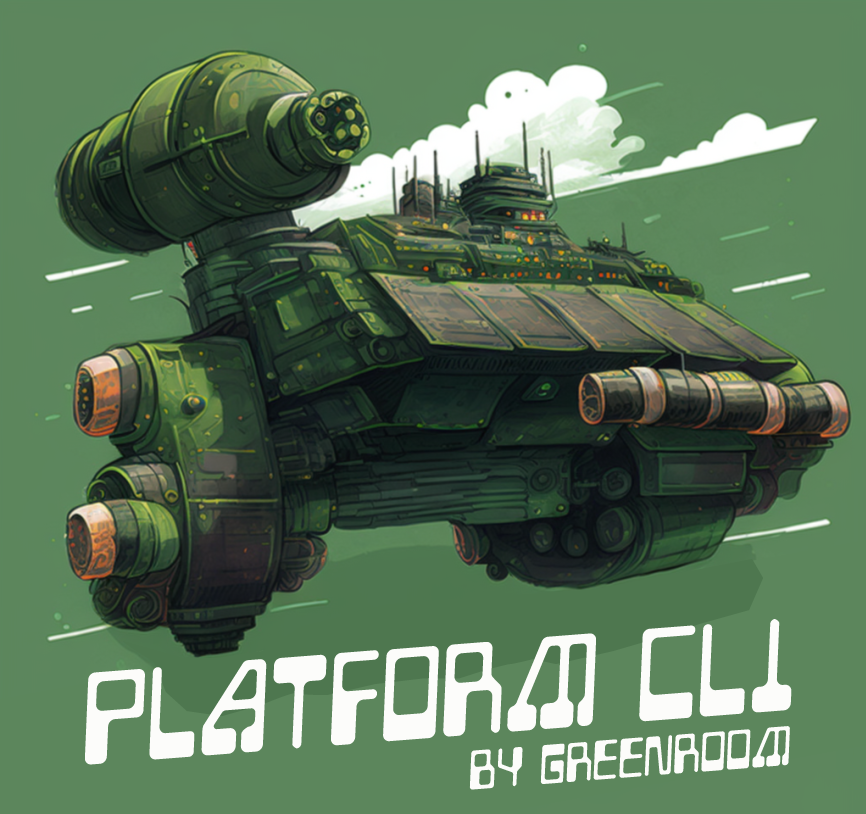

# Platform CLI



A CLI for common commands shared between Greenroom Platform Modules and Platform CI.

## Quick Start

```bash
# Install from GitHub
pip install git+https://github.com/Greenroom-Robotics/platform_cli.git@main

# Or install locally for development
pip install -e .

# View available commands
platform --help
```

## Environment Variables

### Required

| Variable          | Used By      | Description                                        |
| ----------------- | ------------ | -------------------------------------------------- |
| `PLATFORM_MODULE` | `ros`, `pkg` | Platform module name (e.g., `platform_perception`) |
| `ROS_OVERLAY`     | `ros`, `pkg` | ROS installation path (e.g., `/opt/ros/iron`)      |

### Optional / Conditional

| Variable           | Used By                | Default | Description                                                                               |
| ------------------ | ---------------------- | ------- | ----------------------------------------------------------------------------------------- |
| `API_TOKEN_GITHUB` | `pkg setup`, `release` | -       | GitHub PAT with `repo` and `package:read` scope. Required for package setup and releases. |
| `GITHUB_TOKEN`     | `release create`       | -       | Token for semantic-release. Required when running releases.                               |
| `GPU`              | `release deb-prepare`  | -       | GPU build configuration passed to Docker build.                                           |
| `ROS_DISTRO`       | `release`, `pkg`       | `iron`  | ROS distribution to build for.                                                            |
| `CI`               | `release`              | -       | Set to `true` in CI environments for semantic-release.                                    |

## Command Groups

| Group     | Purpose                                    | Example                               |
| --------- | ------------------------------------------ | ------------------------------------- |
| `ros`     | Build, test, and launch ROS packages       | `platform ros build --package my_pkg` |
| `pkg`     | Debian packaging and dependency management | `platform pkg setup`                  |
| `release` | Create releases with semantic versioning   | `platform release create`             |
| `poetry`  | Manage pure Python (non-ROS) packages      | `platform poetry install`             |
| `py`      | Run pytest on Python packages              | `platform py test`                    |
| `ws`      | Manage colcon workspaces in containers     | `platform ws container`               |

Run `platform <group> --help` for detailed command information.

## Common Workflows

### Build and test ROS packages

```bash
platform ros build --package my_package
platform ros test --package my_package
```

### Create a release

```bash
platform release setup
platform release create
```

See [docs/releases.md](./docs/releases.md) for detailed release documentation.

### Set up development environment

```bash
platform pkg setup          # Configure apt and rosdep
platform pkg install-deps   # Install ROS dependencies
```

## Double-Dash Passthrough

Many commands support `--` to pass arguments directly to underlying tools:

```bash
platform ros build -- --packages-select some_package  # Pass to colcon
platform ros build -- --help                          # Show colcon help
platform py test -- -k test_name                      # Pass to pytest
```

## Extending the CLI

Create custom command groups by subclassing `PlatformCliGroup`:

```python
from platform_cli.groups.base import PlatformCliGroup
from platform_cli.cli import init_platform_cli
import click

class MyCommands(PlatformCliGroup):
    def create(self, cli: click.Group):
        @cli.group(help="My custom commands")
        def custom():
            pass

        @custom.command(name="hello")
        def hello():
            click.echo("Hello!")

init_platform_cli(extra_groups=[MyCommands()])
```
