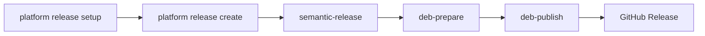
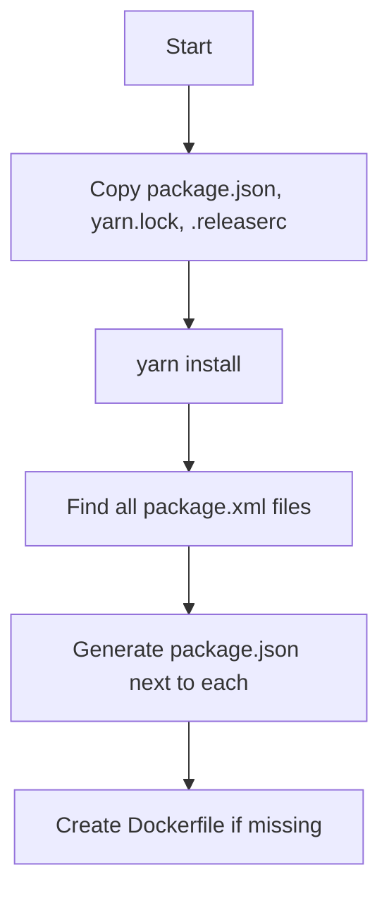
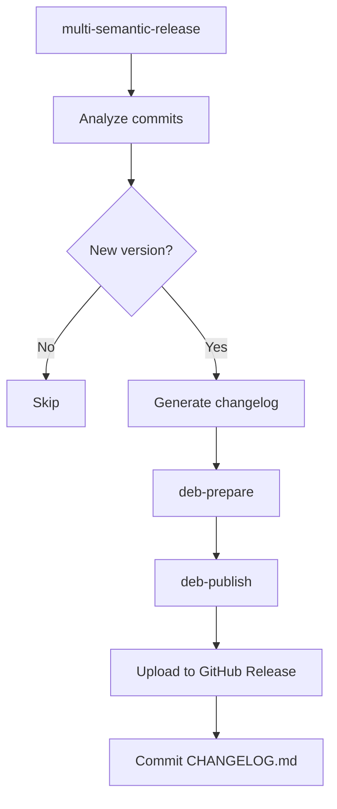
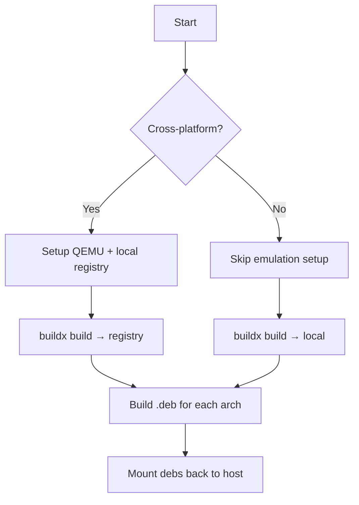

# Releases

## How to create a release

### From CI (recommended)

Run the `release.yml` workflow from any *platform_module* repo.

### Locally

:::danger
You probably shouldn't do this...
:::

From a *platform_module* repo, set the required environment variables (see [README](../README.md#environment-variables)) and run:

```bash
platform release setup
platform release create
```

## Project structure

The release mode is determined automatically based on whether `package.xml` exists in the repo root.

### Single package

A single package with `package.xml` (and `CMakeLists.txt` if C++) in the repo root. Uses `semantic-release` directly.

### Multi package

Multiple packages, each with their own `package.xml`. Uses `multi-semantic-release` to version each package independently.

## How it works

### Overview



### Setup phase

`platform release setup` prepares the repo for semantic-release:



**Note:** The generated `package.json`, `yarn.lock`, and `.releaserc` files should NOT be committed.

### Create phase

`platform release create` triggers the release pipeline:



### Debian build process

`platform release deb-prepare` builds `.deb` packages in Docker:



**Native builds** (target matches host architecture):
- Skips QEMU emulation and local registry
- Uses buildx with local loading
- Faster build times

**Cross-platform builds** (multiple or non-native architectures):
- Sets up QEMU for emulation
- Creates local registry on localhost:5000
- Uses buildx with registry output

## FAQs

### How are versions determined?

Versions are determined by commit messages using [conventional commits](https://www.conventionalcommits.org/en/v1.0.0/):

| Commit prefix | Version bump |
|---------------|--------------|
| `fix:` | Patch (1.0.0 → 1.0.1) |
| `feat:` | Minor (1.0.0 → 1.1.0) |
| `BREAKING CHANGE:` | Major (1.0.0 → 2.0.0) |

### How can I re-release a package?

If a package has no new commits, semantic-release will skip it. To force a re-release:

1. Go to the repo's tags on GitHub
2. Delete the tag for the package
3. Re-run the release workflow

### Why does semantic-release not publish?

Ensure `CI=true` is set. Without it, semantic-release performs a dry-run.
